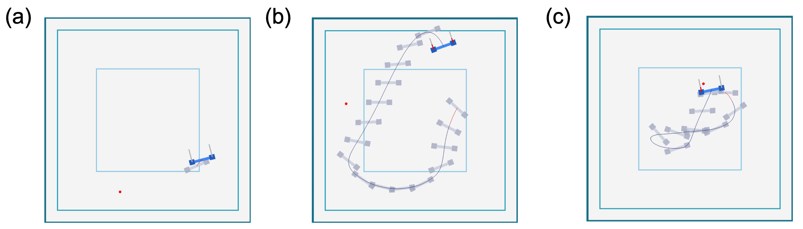

# ECE9143 (Advanced Robotic AI) Project
### Title
Position control and path planning of 2D drone loaded double pendulum via reinforcement learning

  

## Install instructions
Strongly recommend install via Docker. 

Implemented simulation setup as a virtual environment to run the code immediately without additional installation. Since the code is based on docker, you can download the execution environment through my Docker hub. 

### Installation via Docker

    1. Download and install Docker for your OS. 
    2. Pull the image via Docker hub
        docker pull latteishorse/drone:latest
    3. Create a container with the Docker image
        docker run -it --name drone latteishorse/drone:latest

### Attach Docker container to VS code

The environment is set up to run the simulation described earlier in the simulation setup. You can use this simulation through the terminal, but here is how to attach docker to Visual Studio Code for convenience.

    1. Download and install Visual Studio Code.
    2. Install VS Code extension ’Docker’ and Microsoft ’Remote Development’.
    3. Click the ’Docker’ sidebar and choose ’drone’ container.
    4. Right-click the mouse on ’drone’ container, and choose ’Attach to a running container’.

After the above four steps, you can easily handle code and also easily control the docker container.

### Dataset download

## How to run
Fig.2 (c) is the results of running ’eval.py’ for each structure. If you do not get similar results (get results looks like Fig. 2 (b)), you should run ’train.py’ again by increasing the time step and proceed with PPO training.
If you still do not get the result, please contact the author.

  

### Train
    python train.py

### Evaluate
    python eval.py

